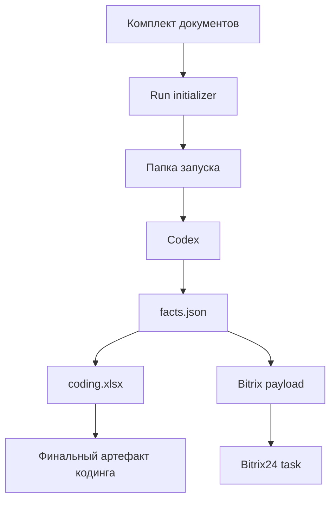

# Codex-First MVP

## Цель

`Codex-first MVP` для `coding` — это минимальный рабочий контур, в котором локальный `Codex` выступает главным исполнителем процесса, а инфраструктура вокруг него остается максимально легкой.

На этом этапе мы не строим полноценный backend и не автоматизируем все на стороне отдельного сервиса. Мы собираем воспроизводимый локальный pipeline, который:

- принимает комплект документов;
- создает структурированный `run`;
- выделяет канонический слой `TenderFacts`;
- готовит артефакты для заполнения кодинга;
- оставляет место для интеграции с `Bitrix24`.

## Почему именно так

Для стартового запуска `coding` это дает лучший баланс:

- быстрое внедрение;
- локальный контроль над файлами;
- прозрачный набор артефактов;
- отсутствие лишней инфраструктуры;
- возможность позже вынести orchestration в `Dify`, не ломая ядро процесса.

## Архитектурная идея



## Что входит в MVP

### 1. Run-based структура

Каждый запуск процесса живет как отдельная папка в `mvp/runs/<run-id>/`.

Это делает процесс:

- воспроизводимым;
- трассируемым;
- удобным для ручной проверки;
- пригодным для дальнейшей автоматизации.

### 2. Канонический слой фактов

Ключевое правило MVP:

`документы -> facts.json -> coding.xlsx + Bitrix24`

Это означает, что `Codex` сначала извлекает и нормализует факты, и только потом на их основе собирает Excel и задачу.

### 3. Минимальный локальный runtime

В MVP есть локальный CLI-скрипт, который:

- создает новый `run`;
- копирует туда входные документы;
- инициализирует обязательные артефакты;
- при необходимости подкладывает шаблон кодинга.

### 4. Human-in-the-loop

Даже в `Codex-first` варианте остается ручной контроль:

- проверка `facts.json`;
- проверка заполненного файла кодинга;
- подтверждение перед созданием или завершением задачи в `Bitrix24`.

## Структура MVP

```text
scoring/
├── docs/
│   └── CODEX-FIRST-MVP.md
└── mvp/
    ├── README.md
    ├── schemas/
    │   └── tender-facts.schema.json
    ├── scripts/
    │   └── init_run.py
    └── runs/
```

## Канонические артефакты запуска

Внутри каждого `run` должны быть такие сущности:

- `input/`
  исходные документы;
- `normalized/`
  текстовые выгрузки и промежуточные представления;
- `output/`
  итоговые артефакты;
- `facts.json`
  нормализованный слой фактов;
- `bitrix-task.json`
  состояние интеграции с `Bitrix24`;
- `run-log.json`
  статус запуска и журнал шагов;
- `summary.md`
  краткая сводка по запуску и следующие шаги.

## Минимальный жизненный цикл запуска

### Шаг 1. Инициализация run

Создается рабочая папка запуска и базовые артефакты.

### Шаг 2. Работа Codex

`Codex`:

- читает документы из `input/`;
- при необходимости создает текстовые представления в `normalized/`;
- заполняет `facts.json`;
- собирает `output/coding.xlsx`;
- подготавливает данные для `Bitrix24`.

### Шаг 3. Проверка человеком

Оператор проверяет:

- корректность извлеченных фактов;
- корректность заполнения таблицы;
- готовность к созданию задачи.

### Шаг 4. Фиксация результата

После подтверждения:

- создается или фиксируется задача в `Bitrix24`;
- обновляется `bitrix-task.json`;
- `run-log.json` переводится в конечный статус.

## Что не входит в MVP

На этом этапе мы сознательно не делаем:

- отдельный backend;
- очередь запусков;
- многопользовательскую web-панель;
- автоматическое распределение ролей;
- сложный review UI.

Все это можно добавить позже, если `coding` станет регулярной массовой операцией.

## Следующий уровень развития

Когда `Codex-first MVP` заработает стабильно, следующий шаг выглядит так:

- вынести orchestration в `Dify`;
- оставить локальный `Codex` как execution worker;
- вынести `Bitrix24` в отдельный интеграционный адаптер;
- ввести review step как формальный этап workflow.

## Практический вывод

На старте `Codex-first MVP` — это не "маленький чат с промптом", а локальный операционный контур с четкой структурой запуска и каноническими артефактами.

Его задача не заменить будущую систему целиком, а дать рабочую и расширяемую основу, на которой уже можно запускать реальные тендеры.
