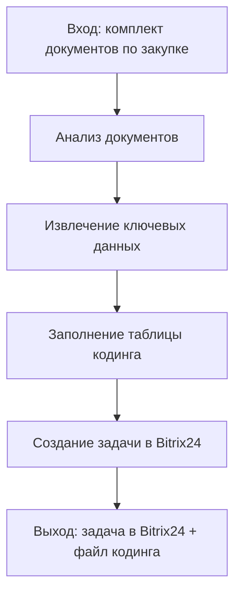

# Coding Process

## Зачем нужен процесс

`coding` в контуре `scoring/` — это быстрый операционный процесс первичного разбора тендера или закупки.

Его задача:

- принять комплект входных документов;
- извлечь из них данные, важные для участия и предоценки;
- зафиксировать результат в таблице кодинга;
- создать рабочую задачу в `Bitrix24`;
- получить связанный артефакт: заполненный файл кодинга и задача, в которой этот файл используется как рабочая основа.

## Вход

На вход процесса подается набор документов по закупке. Обычно это:

- извещение;
- техническое задание;
- структура сайта или иные приложения;
- дополнительные файлы заказчика, если они есть.

Минимальное условие старта процесса: документов достаточно, чтобы идентифицировать предмет закупки и заполнить базовые поля таблицы.

## Основной сценарий

## Шаги процесса

### 1. Получение документов

В процесс поступает комплект материалов по закупке.

На этом шаге важно:

- собрать документы в одном месте;
- проверить, что они относятся к одному тендеру;
- убедиться, что документы можно открыть и прочитать.

### 2. Анализ документов

Документы просматриваются как единый пакет.

Из них извлекаются данные, которые нужны для кодинга:

- заказчик;
- предмет закупки;
- срок подачи;
- формат закупки;
- критерии выбора подрядчика;
- обязательные требования;
- базовые организационные условия.

### 3. Заполнение таблицы кодинга

На основе анализа заполняется таблица кодинга.

В таблице фиксируются:

- общая информация по закупке;
- ссылки на документы и источники;
- критерии выбора подрядчика;
- требования без веса;
- иные поля, предусмотренные шаблоном таблицы.

Результат этого шага — заполненный файл кодинга.

### 4. Создание задачи в Bitrix24

После того как таблица заполнена, создается задача в `Bitrix24`.

Задача нужна как операционная точка сопровождения кодинга:

- чтобы зафиксировать сам факт обработки тендера;
- чтобы связать участников процесса с конкретной закупкой;
- чтобы использовать заполненную таблицу как рабочий артефакт внутри задачи.

## Выход

На выходе процесса формируются два связанных результата:

- заполненная таблица кодинга;
- задача в `Bitrix24`.

Итог процесса считается достигнутым, когда:

- таблица кодинга заполнена;
- задача в `Bitrix24` создана;
- файл кодинга используется как артефакт по этой задаче.

## Короткая формула процесса

`Документы -> анализ -> заполнение таблицы кодинга -> создание задачи в Bitrix24 -> задача + файл кодинга`

## Границы процесса

В этот процесс не входят:

- детальная сметная оценка;
- полноценная проектная проработка;
- исполнение работ по самому тендеру;
- дальнейшее ведение задачи после создания.

Иными словами, `coding` — это быстрый входной операционный контур, который превращает комплект документов в структурированный файл и рабочую задачу.
