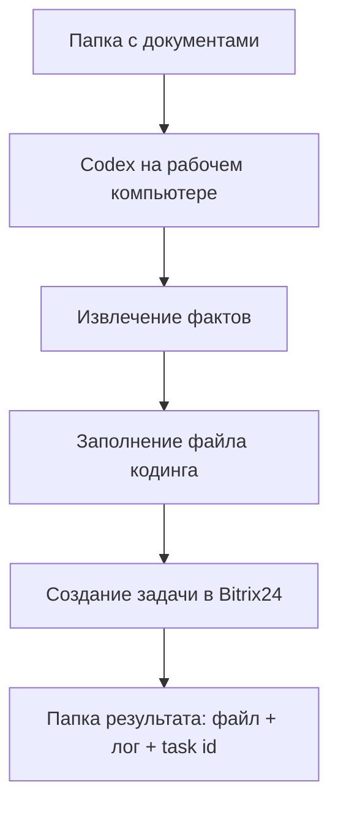
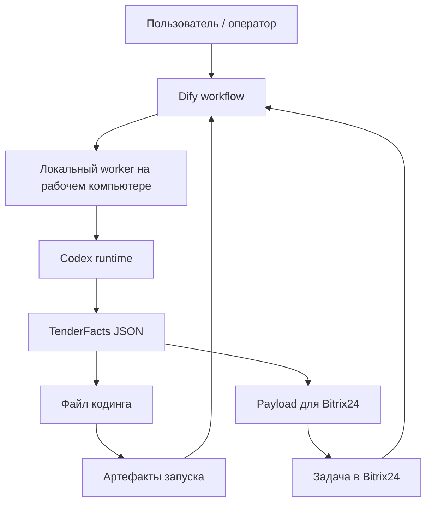
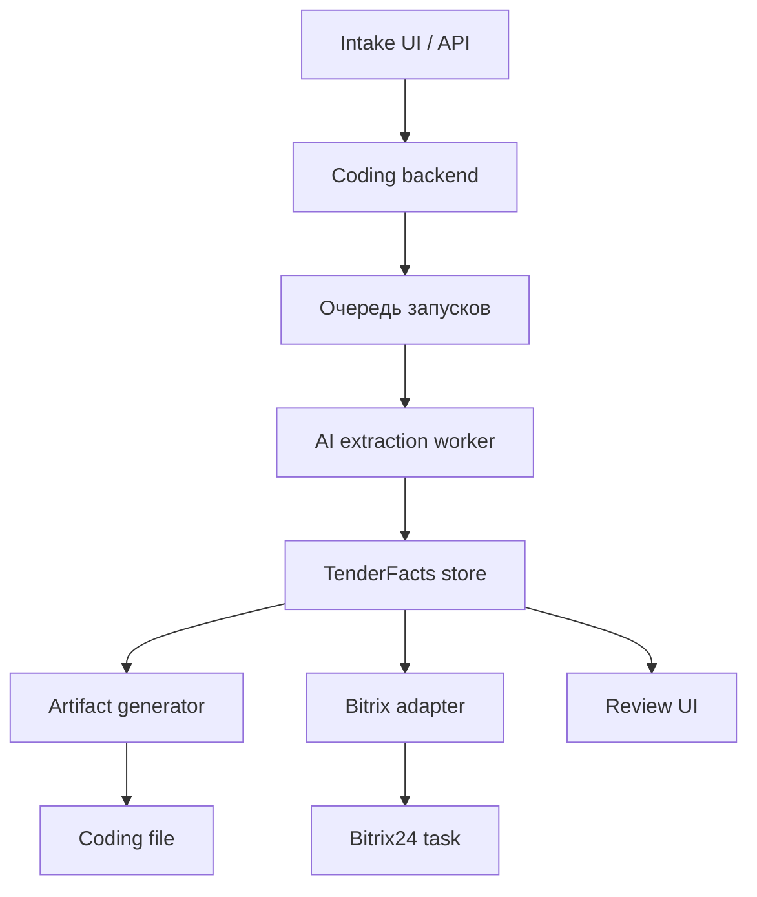

# Coding Solution Architectures

## Контекст

Ниже я исхожу из следующего понимания задачи:

- `coding` — это быстрый операционный процесс по тендеру;
- на вход приходит комплект документов;
- из документов нужно извлечь факты;
- по ним нужно заполнить файл кодинга;
- затем нужно создать задачу в `Bitrix24`;
- решение хочется строить как `AI-first`, а не как классическую ручную форму с парой скриптов;
- у тебя есть доступ к `Dify` и есть возможность поставить `Codex` на рабочий компьютер.

Если это понимание верное, то под такую задачу можно рассматривать три нормальных архитектурных варианта.

## Что должно быть в любом варианте

Независимо от конкретной сборки, у решения почти всегда будут одни и те же логические блоки:

- входной контур документов;
- слой извлечения фактов из документов;
- слой оркестрации процесса;
- генерация артефактов;
- интеграция с `Bitrix24`;
- журнал запуска и трассировка результата;
- точка ручной проверки.

Иными словами, хорошая архитектура здесь строится не вокруг Excel как такового, а вокруг канонического процесса:

`документы -> факты -> кодинг -> задача Bitrix24 -> артефакты процесса`

## Каноническая доменная схема

Чтобы решение не рассыпалось на промпты и временные скрипты, полезно заранее ввести внутреннюю модель данных.

Минимально нужны такие сущности:

- `DocumentPackage`
  один комплект документов по одной закупке;
- `TenderFacts`
  извлеченные факты: заказчик, предмет, сроки, критерии выбора, требования без веса, ссылки, примечания;
- `CodingSheetPayload`
  нормализованный набор значений, которые должны быть записаны в таблицу;
- `BitrixTaskPayload`
  данные для создания задачи в `Bitrix24`;
- `CodingRun`
  один запуск процесса с входом, результатом, статусом, ошибками и ссылками на артефакты.

Это очень важно: AI должен не напрямую "думать в Excel", а сначала собирать `TenderFacts`, и уже потом из них собирать Excel и задачу.

## Вариант A. Локальный Codex-first

### Идея

Самый простой старт: вся логика работает на рабочем компьютере, где установлен `Codex`.

`Codex` здесь выступает как основной AI-исполнитель:

- читает документы;
- раскладывает их в факты;
- формирует файл кодинга;
- вызывает интеграцию в `Bitrix24`;
- сохраняет результат в локальную папку процесса.

### Схема

### Компоненты

- локальная папка входа;
- локальный шаблон таблицы кодинга;
- локальный скрипт-адаптер для `Bitrix24`;
- `Codex` как основной orchestration/runtime слой;
- папка результатов по каждому запуску.

### Плюсы

- самый быстрый старт;
- почти нет инфраструктуры;
- удобно для ручного контроля;
- легко отлаживать на реальных документах;
- документы остаются на рабочем компьютере.

### Минусы

- слабая масштабируемость;
- orchestration завязан на одну машину;
- тяжелее строить очередь, роли и многопользовательскую работу;
- меньше прозрачности для бизнеса, если процесс будет выполняться не только тобой.

### Когда выбирать

Этот вариант подходит, если цель:

- быстро запустить рабочий MVP;
- проверить качество извлечения фактов;
- не строить пока отдельную платформу.

## Вариант B. Гибрид: Dify как control plane, Codex как execution plane

### Идея

Это наиболее сильный стартовый вариант под твои вводные.

`Dify` используется как внешний оркестратор и входная точка процесса, а `Codex` на рабочем компьютере — как локальный исполнитель операций, которым нужен доступ к файлам, Excel и локальному окружению.

### Логика разделения

`Dify` отвечает за:

- запуск workflow;
- хранение сценария процесса;
- маршрутизацию шагов;
- пользовательскую точку входа;
- статус процесса и, возможно, базовую review-логику.

`Codex` отвечает за:

- чтение исходных документов;
- извлечение и структурирование фактов;
- генерацию файла кодинга;
- локальные операции с файлами;
- вызов адаптера `Bitrix24`;
- возврат артефактов и статусов назад в orchestrator.

### Схема

### Компоненты

- `Dify` workflow;
- локальный worker-адаптер на рабочем компьютере;
- `Codex` внутри этого worker-контурa;
- шаблон Excel;
- сервисный модуль интеграции с `Bitrix24`;
- локальное или сетевое хранилище артефактов;
- канонический JSON-слой между AI и интеграциями.

### Плюсы

- хорошее разделение orchestration и execution;
- AI-first без потери контроля над локальными файлами;
- можно быстро добавить review step;
- можно постепенно заменить куски runtime без переделки всего процесса;
- удобно для дальнейшей автоматизации.

### Минусы

- сложнее стартовой локальной версии;
- нужно продумать контракт между `Dify` и локальным worker;
- появляется дополнительный инфраструктурный слой.

### Почему это выглядит лучшим стартом

Потому что здесь:

- не нужно сразу строить тяжелую платформу;
- документы и Excel остаются рядом с рабочими инструментами;
- orchestration уже можно формализовать как настоящий бизнес-процесс;
- потом проще масштабировать на других пользователей и типы закупок.

## Вариант C. Полноценный сервис кодинга

### Идея

Это уже не "AI-помощник вокруг ручного процесса", а отдельный продуктовый сервис кодинга.

У него появляется собственный backend и собственный доменный runtime:

- intake API;
- очередь задач;
- document parser;
- AI extraction service;
- artifact generator;
- Bitrix adapter;
- база запусков;
- web-интерфейс review.

### Схема

### Плюсы

- максимальная масштабируемость;
- хорошая наблюдаемость;
- можно делать полноценный audit trail;
- проще поддерживать разные сценарии кодинга;
- можно строить очередь, SLA, роли и аналитику.

### Минусы

- самый дорогой и длинный путь;
- до MVP слишком много инфраструктуры;
- высокий риск переинжиниринга на старте.

### Когда выбирать

Только если уже понятно, что:

- кодинг станет регулярной массовой операцией;
- пользователей будет несколько;
- нужен отдельный продуктовый контур с интерфейсами и историей запусков.

## Рекомендуемая стартовая архитектура

Если говорить честно, я бы рекомендовал не прыгать сразу в вариант C.

Стартовая рекомендация:

`Вариант B: Dify + локальный Codex worker`

Потому что он дает правильную AI-first геометрию:

- orchestration уже внешний и формальный;
- локальные документы и Excel не нужно вытаскивать в облачный сервис;
- `Codex` может работать там, где реально лежат файлы и шаблоны;
- `Bitrix24` можно подключать как отдельный адаптер, а не зашивать в промпт;
- архитектура не закрывает путь к будущему сервису.

## Как бы я разложил рекомендованный вариант по слоям

### 1. Intake layer

Назначение:

- принять комплект документов;
- присвоить запуску идентификатор;
- положить материалы в рабочую папку запуска.

Что это может быть:

- папка intake;
- загрузка через `Dify`;
- ручной старт workflow с приложенными файлами.

### 2. Orchestration layer

Назначение:

- запускать pipeline;
- хранить шаги процесса;
- фиксировать статусы;
- управлять human-in-the-loop.

Что это может быть:

- `Dify workflow`.

### 3. Local execution layer

Назначение:

- иметь доступ к локальным файлам;
- запускать `Codex`;
- выполнять генерацию артефактов;
- работать с Excel и документами.

Что это может быть:

- локальный worker на рабочем компьютере;
- `Codex` как агент внутри этого worker.

### 4. Extraction layer

Назначение:

- превратить сырой пакет документов в `TenderFacts`.

Выход:

- `facts.json`;
- `summary.md`;
- confidence/flags по спорным местам.

### 5. Artifact layer

Назначение:

- заполнить таблицу кодинга;
- при необходимости собрать вспомогательный HTML/markdown summary;
- подготовить финальный пакет артефактов.

Выход:

- `coding.xlsx`;
- `facts.json`;
- `run-log.json`;
- `summary.md`.

### 6. Integration layer

Назначение:

- создать задачу в `Bitrix24`;
- приложить или связать файл кодинга;
- вернуть `task_id`, ссылку и статус.

Очень желательно, чтобы это был отдельный модуль, а не prompt-level магия.

### 7. Review layer

Назначение:

- показать человеку спорные поля;
- позволить подтвердить или поправить результат;
- только после этого переводить запуск в `done`.

Для coding-процесса это особенно полезно, потому что тендерные документы часто грязные и неоднородные.

## Канонические артефакты запуска

Я бы рекомендовал на каждый запуск хранить вот такой набор:

- `input/`
  исходные документы;
- `normalized/`
  OCR, текстовые выгрузки, промежуточные представления;
- `facts.json`
  канонический результат извлечения;
- `coding.xlsx`
  заполненный файл кодинга;
- `bitrix-task.json`
  что ушло в `Bitrix24` и что вернулось;
- `run-log.json`
  статус, таймстемпы, ошибки;
- `review.md`
  спорные места и ручные замечания.

Это делает процесс воспроизводимым и очень упрощает отладку.

## Важное архитектурное правило

Самое опасное здесь — сделать систему, где AI сразу:

- читает документы;
- пишет Excel;
- создает задачу;
- и нигде не оставляет нормализованный слой фактов.

Так делать не стоит.

Правильнее:

`документы -> facts.json -> Excel / Bitrix24`

Тогда:

- можно проверять качество извлечения отдельно от качества интеграций;
- можно переиспользовать факты в других процессах;
- можно менять шаблон кодинга без переписывания extraction-логики;
- можно позже строить аналитику по закупкам.

## Поэтапный путь внедрения

### Этап 1. MVP

- локальная папка запуска;
- `Codex` на рабочем компьютере;
- генерация `facts.json`;
- генерация `coding.xlsx`;
- полуавтоматическое создание задачи в `Bitrix24`.

### Этап 2. Нормальный operational contour

- `Dify` как orchestrator;
- локальный worker;
- автоматическое создание задачи в `Bitrix24`;
- review step перед финальным подтверждением.

### Этап 3. Productization

- централизованная история запусков;
- несколько шаблонов кодинга;
- аналитика по типам тендеров;
- выделенный backend или сервис кодинга.

## Вывод

Если коротко, я бы предложил такую стратегию:

1. Не строить сразу отдельный большой сервис.
2. Ввести канонический слой `TenderFacts`.
3. Использовать `Dify` как orchestration layer.
4. Использовать `Codex` на рабочем компьютере как local execution worker.
5. Выделить `Bitrix24` в отдельный адаптер.
6. Хранить каждый запуск как набор артефактов, а не только как итоговый Excel.

Если нужно, следующим шагом можно уже не просто обсуждать варианты, а собрать:

- целевую `C4-lite` схему;
- состав модулей;
- модель папок и артефактов;
- пошаговый roadmap MVP.
