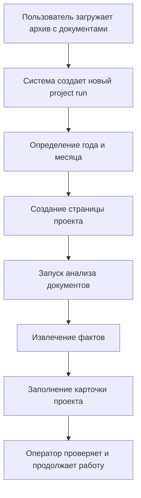

# Coding Web Architecture

## Статус документа

Этот документ фиксирует целевую архитектурную идею.

Он описывает:

- структуру будущего сайта кодинга;
- базовый пользовательский поток;
- роль `Codex` на первом этапе;
- направление дальнейшей синхронизации с `Dify`.

Важно:

- это архитектурная фиксация;
- это не старт разработки;
- документ не означает, что реализация уже начата.

## Контекст

Нужен не просто локальный runtime и не просто Excel-шаблон, а отдельный внутренний сайт для процесса `coding`.

Этот сайт должен унаследовать понятную человеку операционную структуру, близкую к тому, как работа раньше воспринималась через Excel и папки:

- есть год;
- внутри года есть месяц;
- внутри месяца есть конкретный проект;
- проект идентифицируется днем и названием.

Иными словами, базовая информационная и навигационная модель должна быть такой:

`Год -> Месяц -> Проект (день + название)`

## Главная идея

Будущий сайт кодинга должен стать основным интерфейсом работы с тендерами.

При этом:

- пользователь загружает архив или папку с документами;
- система определяет, куда этот кейс должен лечь по структуре времени;
- в соответствующем месяце создается страница проекта;
- по документам запускается анализ;
- результат анализа становится содержимым страницы проекта;
- далее из этой страницы уже можно управлять кодингом и связанными артефактами.

На первом этапе основным AI-исполнителем остается `Codex`.

Позже этот же процесс можно будет завернуть в `Dify`, чтобы `Codex` перестал восприниматься как отдельный ручной инструмент и стал внутренним execution-слоем процесса.

## Цель системы

Система должна решать следующие задачи:

- принимать архив или набор документов по тендеру;
- автоматически создавать карточку проекта в нужной временной секции;
- запускать первичный анализ документов;
- фиксировать результат анализа в структурированном виде;
- давать оператору удобный интерфейс вместо прямой работы в Excel;
- при необходимости экспортировать или собирать Excel как артефакт;
- в дальнейшем связывать результат с `Bitrix24`.

## Информационная архитектура

### Навигационная структура

Базовое дерево сайта:

```text
Coding
└── Год
    └── Месяц
        └── Проект
            ├── Обзор
            ├── Документы
            ├── Извлеченные факты
            ├── Кодинг
            ├── Bitrix24
            └── История / лог
```

### Правило именования проекта

Проект внутри месяца должен отображаться в формате, близком к существующей логике ручной работы:

`<день> <краткое название проекта>`

Например:

- `09 НЛМК`
- `16 ЦЕМРОС БЛОК`
- `27 Разработка сайта`

Это нужно для двух целей:

- сохранить узнаваемую операционную модель;
- не ломать привычку ориентироваться по месяцу, дню и короткому имени проекта.

### Временная иерархия

Год и месяц должны быть не декоративными разделами, а первичным способом организации кейсов.

Это означает:

- новые проекты создаются внутри конкретного месяца;
- при загрузке архива система должна пытаться определить правильный месяц автоматически;
- если дата определяется неоднозначно, система должна сохранять флаг на ручную проверку.

## Базовый пользовательский поток



## Сценарий создания проекта

### Шаг 1. Загрузка архива

Пользователь загружает:

- архив;
- или папку, приведенную к архивному виду;
- или набор документов, если интерфейс это позволит.

На первом этапе главным сценарным входом считается именно архив с документами.

### Шаг 2. Создание project run

После загрузки создается новый внутренний запуск процесса.

На этом уровне еще не важен UI, важно зафиксировать, что система создала сущность проекта, к которой будут привязаны:

- документы;
- извлеченные факты;
- файл кодинга;
- история действий;
- будущая задача в `Bitrix24`.

### Шаг 3. Определение месяца

Система должна определить, в какой год и месяц положить проект.

Источники для определения:

- дата из имени архива;
- дата из извещения;
- дата окончания подачи;
- дата публикации;
- иные явные даты в документах.

Приоритетная идея:

- сначала система пытается определить месяц автоматически;
- затем, если уверенность достаточна, сама создает проект в нужной секции;
- если уверенность недостаточна, проект создается с флагом `требует проверки даты`.

### Шаг 4. Создание страницы проекта

После определения месяца система создает проектную страницу.

Это уже не просто папка, а объект сайта, у которого есть:

- название;
- дата;
- путь в дереве `год -> месяц -> проект`;
- комплект документов;
- статус анализа;
- структурированные разделы.

### Шаг 5. Анализ документов

После создания страницы автоматически запускается анализ документов.

Результатом анализа должны стать не просто текстовые заметки, а нормализованные данные:

- заказчик;
- предмет закупки;
- срок подачи;
- критерии выбора подрядчика;
- требования без веса;
- ссылки и источники;
- комментарии и спорные места.

### Шаг 6. Наполнение страницы проекта

После анализа проектная страница заполняется результатом:

- в блоке обзора;
- в блоке документов;
- в блоке extracted facts;
- в блоке кодинга;
- позже в блоке `Bitrix24`.

## Роль Codex на первом этапе

На первом этапе `Codex` рассматривается как основной execution-слой.

Его роль:

- читать загруженные документы;
- извлекать факты;
- формировать канонический слой данных;
- заполнять связанный артефакт кодинга;
- обновлять состояние проекта.

Важно:

`Codex` в этой модели не должен быть пользовательским интерфейсом.

Пользовательский интерфейс — это сайт.

`Codex` — это внутренний исполнитель, который стоит за шагом анализа и формирования артефактов.

## Дальнейшая роль Dify

На следующем этапе `Dify` рассматривается как orchestration layer.

Это означает, что позже архитектура может стать такой:

- сайт дает оператору интерфейс;
- `Dify` управляет workflow;
- `Codex` выполняет локальные или интеллектуальные шаги;
- `Bitrix24` подключается как отдельная интеграция.

Иными словами:

- сейчас мы фиксируем `Codex-first` логику;
- позже можно перейти к `Dify-orchestrated` модели;
- но сама информационная модель сайта при этом не должна ломаться.

## Логическая модель страницы проекта

Каждая страница проекта должна содержать как минимум такие блоки:

### 1. Обзор

Содержит:

- название проекта;
- дату;
- статус;
- краткий итог анализа;
- ключевые метки.

### 2. Документы

Содержит:

- исходный архив;
- список распакованных документов;
- типы документов;
- служебные текстовые представления, если они были получены.

### 3. Извлеченные факты

Содержит:

- нормализованный набор полей по тендеру;
- confidence flags;
- спорные места;
- ручные правки оператора.

### 4. Кодинг

Содержит:

- текущее состояние кодинга;
- связанный файл или web-представление;
- результаты автоматического заполнения;
- итоговую версию артефакта.

### 5. Bitrix24

Содержит:

- статус создания задачи;
- идентификатор задачи;
- ссылку;
- служебный payload интеграции.

### 6. История / лог

Содержит:

- когда проект был создан;
- какие шаги анализа уже выполнены;
- кто вносил ручные корректировки;
- какие артефакты были сформированы.

## Что должно быть source of truth

Важно заранее зафиксировать:

сайт не должен строиться вокруг Excel как вокруг главного источника истины.

Правильная модель:

- source of truth — это структурированные данные проекта;
- Excel — это один из выходных артефактов;
- сайт — это основной операционный интерфейс;
- `Codex` и позже `Dify` — это процессный слой, а не UI.

Иначе говоря:

`Документы -> факты -> страница проекта -> Excel / Bitrix24`

а не:

`Документы -> Excel -> все остальное`

## Почему не хочется делать Excel главным интерфейсом

Если ориентироваться на описанный сценарий, Excel неудобен как центральная рабочая форма по нескольким причинам:

- плохо отображает этапность процесса;
- неудобен для хранения документов и логов;
- не годится как естественная навигация по годам и месяцам;
- слабо подходит для автоматического анализа и review;
- неудобен как основной интерфейс для AI-first сценария.

Поэтому на уровне архитектуры нужно сразу считать, что:

- сайт — основной интерфейс;
- Excel — экспортируемый или совместимый артефакт;
- внутренняя структура должна жить в системе, а не в таблице.

## Минимальная целевая модель MVP сайта

Если сильно упростить будущий MVP, то у него должен быть такой набор экранов:

- список лет;
- страница месяца со списком проектов;
- страница конкретного проекта;
- форма загрузки архива;
- экран просмотра extracted facts;
- действие запуска анализа;
- действие формирования кодинга.

Этого достаточно, чтобы уже уйти от Excel-first подхода.

## Границы документа

Этот документ пока не отвечает на вопросы:

- какой стек будет у сайта;
- какой backend будет выбран;
- как именно будет реализован upload;
- как именно будет происходить OCR и parsing;
- как устроить синхронизацию с `Dify`.

Сейчас задача документа — зафиксировать саму архитектурную форму будущей системы.

## Короткий вывод

Целевая архитектурная идея выглядит так:

- есть внутренний сайт кодинга;
- он организован как `год -> месяц -> проект`;
- проект создается автоматически при загрузке архива;
- проектная страница создается в нужном месяце;
- после создания страницы запускается анализ документов;
- `Codex` на первом этапе выполняет analysis/runtime роль;
- позже orchestration можно вынести в `Dify`;
- Excel должен остаться артефактом, но не центром системы.
